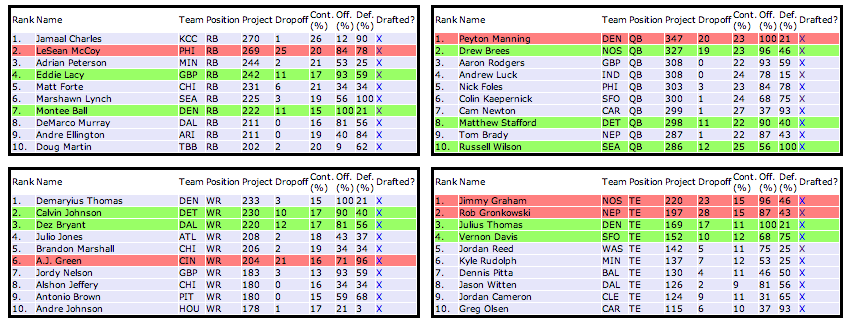

FF2014: The Dropoff
===================================

A FF2014 player recommendation generator, The Dropoff is based on the premise that the best player available in a snake draft is the player where the next best at the given position has the highest dropoff in total points. 

Underlying player data is courtesy of Tony Holm's FantasySharks.com and [can be found in a variety of formats here](http://www.fantasysharks.com/apps/Projections/SeasonProjections.php?pos=ALL).

The Dropoff is an [open-source project](http://benbrostoff.github.io/2014/08/17/open-source-everything/) and I welcome pull requests, questions and comments. The <b>Development</b> section below walks through setup. The hope is that I can improve each year based on my experiences in my respective drafts.

## Screenshots



## Development 

You'll need Rails and Postgres installed in order to work with this project. 

Upon forking the repo:

```
bundle install 

rake db:create
rake db:migrate
rake db:seed

rails s
```

Please email me directly, raise an issue or submit a pull request should you wish to contribute :-), and happy drafting! 
